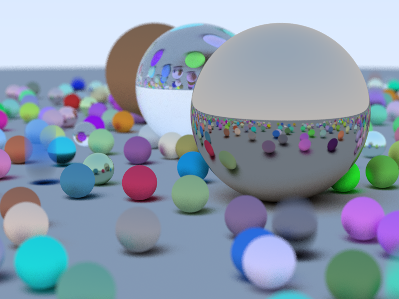
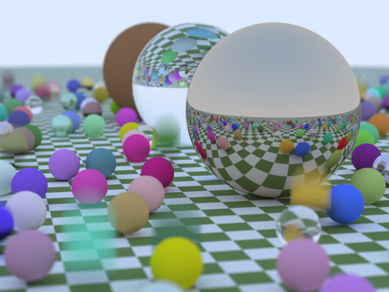
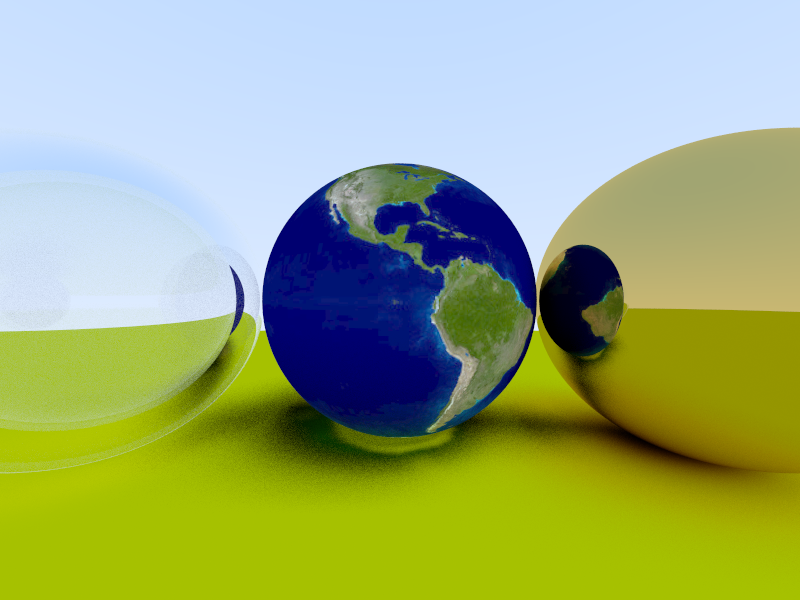
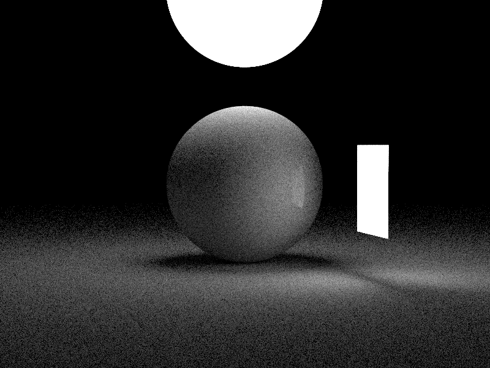
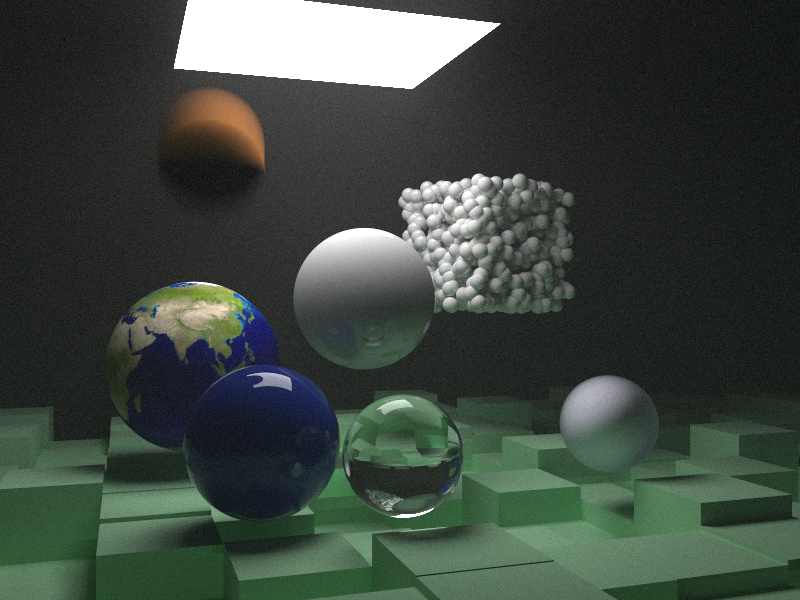
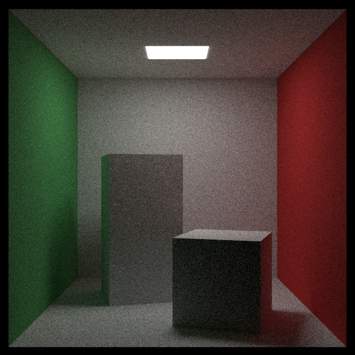
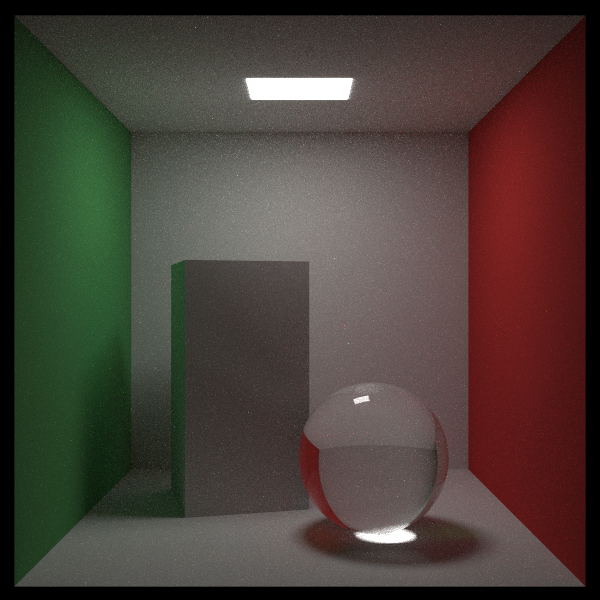

# raytracer-rs
A new attempt at writing a simple raytracer. This time, no fumbling about with real-time stuff, but
instead creating a good-old, offline renderer. Based on
<https://raytracing.github.io/books/RayTracingInOneWeekend.html>.


## Installation
To get started with this project, first make sure that you install [Rust](https://rust.org). The
easiest is to download it using rustup, [here](https://rustup.rs/) (don't forget to process the new
environment file).

Once downloaded, you can then clone this repository:
```bash
git clone https://github.com/Lut99/raytracer-rs ./raytracer
cd raytracer
```

The project can then be compiled using [Cargo](https://crates.io/):
```bash
cargo build --release
```
and executed using:
```bash
# Unix
./target/release/raytracer
```
```bash
# Windows
./target/release/raytracer.exe
```


## Usage

### Command-Line Interface
The `raytracer` executable has various features. Currently, these are them:
- `raytracer render image <file>` renders a scene defined in a _scene file_ (see
  [below](#scene-files)) to an image. There are some additional options available, use
  `raytracer render --help` to see them.
- `raytracer render cover <book>` renders a scene from any of the three book's covers. Options are
  `book1`, `book2` and `book3`. Again, see `raytracer render --help` for more options.
- `raytracer generate` is the subcommand that groups the generation of various files. The following
  sub-subcommands are supported:
  - `raytracer generate gradient`: Generates the
    [example gradient image](https://raytracing.github.io/books/RayTracingInOneWeekend.html#outputanimage/creatinganimagefile)
    from the tutorial we are using.

### Scene files
To describe a scene to render, we use our own scene file format. It is written in
[JSON](https://json.org) and has the following three toplevel fields:
- `environment` _(optional)_: Defines global scene properties:
  - `air_refraction_index` _(optional)_: A float determining the base refraction index of the "air"
    of the scene. The _difference_ between the air's and a material's refraction index determines
    the way a ray refracts. Defaults to 1.0 if omitted.
  - `background` _(optional)_: Some description of the background of the scene. Options are:
    - `{"type": "colour", "colour": [R, G, B, A]}`: A background that emits a solid light with the
      given RGBA-colour.
    - `{"type": "illuminated_sky"}`: A background that emits light according to a nice skylike
      gradient (default if omitted).
    - `{"type": "none"}`: A solid black background.
- `camera` _(optional)_: Defines camera properties:
  - `dims` _(optional)_: A pair of pixel width- and height of the resulting image. Defaults to 800
    by 600 if omitted.
  - `n_samples` _(optional)_: Defines the number of samples to shoot per-pixel. Defaults to 100 if
    omitted.
  - `vfov` _(optional)_: A float describing the vertical Field-of-View (FoV). Defaults to 90 if
    omitted.
  - `defocus_angle` _(optional)_: A float describing the angle at which rays are cast. A wider
    angle leads to a larger difference between near-and far objects. Use 0.0 to disable. Defaults
    to 0.0 if omitted.
  - `focus_dist` _(optional)_: A float describing the distance from the camera where objects are
    sharp if there is a defocus angle (ignored otherwise). Defaults to 0.0 if omitted.
  - `shutter_time` _(optional)_: An unsigned integer describing the time (in in-scene microseconds)
    that the camera stays open. A larger shutter time leads to blurrier objects if they move.
    Defaults to 1 (akin to no shutter time).
  - `pos` _(optional)_: A triplet of...
    - `lookfrom`: A 3D vector describing the position of the camera.
    - `lookat`: A 3D vector describing a point where the camera is target at.
    - `lookup`: A 3D vector describing the axis that counts as "up" for the camera.
  
    If omitted, defaults to `{"lookfrom": [0, 0, 0], "lookat": [0, 0, -1], "lookup": [0, 1, 0]}`.
- `objects`: A list of objects that are added to the scene.

  Every objects always has the following properties:
  - `type`: The type of the object. See below for a list.
  - `mat`/`material`: A dict describing the material which the object is made out of. See below for
    a list.
  - `volume`: Whether the object is not a facade but e.g. a gass cloud (something volumous). See
    below for a list.
  - `transforms`: A list of transformations to apply to the object. See below for a list.

  In addition, there may be object-specific fields (see below).

  But, alternatively, you can also give a group of objects, which has a nested `objs` and
  `transforms`-key instead of the above.

  You can also specify a model by giving a `path` pointing to the model's file, an optional
  `format` for the object and the usual `volume`- and `transform` keys. The model will be loaded
  later.

The following objects are supported:
- `"type": "box", "x": [x1, x2], "y": [y1, y2], "z": [z1, z2]`: An axis-aligned box. Defines by
  giving three intervals, defining its and position size in each dimension.

  You can rotate it later using transforms.
- `"type": "sphere", "center": [x, y, z], "radius": r`: A sphere, placed at `center` and with
  radius `radius`.
- `"type": "triangle", "pos": [x, y, z], "u": [x, y, z], "v": [x, y, z]`: A 2D triangle, spanned
  from `pos` between the given `u` and `v` vectors.
- `"type": "quad", "pos": [x, y, z], "u": [x, y, z], "v": [x, y, z]`: A 2D quad, spanned  from
  `pos` between the given `u` and `v` vectors. An implicit fourth point is added by assuming the
  `u`/`v` points are "halfway" the plane (i.e., it looks like a diamond).

The following materials are supported:
- `"type": "dielectric", "colour": [R, G, B, A], "refraction_index": i`: A glass-like material that
  bends rays entering it. The amount of bending is determined by the difference of the given
  `refraction_index` and the environment's refraction index.
- `"type": "partial_dielectric, "colour": [R, G, B, A], "refraction_index": i"`: A less perfect
  version of the normal `dielectric` that never reflects, only refracts.
- `"type": "diffuse", "colour": [R, G, B, A]`: A material randomly scattering rays. This is a less
  perfect version of the `lambertian`.
- `"type": "lambertian", "colour": [R, G, B, A]`: A material randomly scattering rays.
- `"type": "lambertian_texture", "texture": T`: A material randomly scattering rays, coloured by a
  texture. The possible textures are given below.
- `"type": "metal", "colour": [R, G, B, A], "fuzz": f`: A material reflecting rays like a mirror.
  A fuzz higher than 0 will make the reflections less perfect.
- `"type": "normal_map"`: A material emitting light with a colour determined by the angle of the
  normal where the ray hit.
- `"type": "static_colour", "colour": [R, G, B, A]`: A material emitting a static colour when a ray
  hits it.
- `"type": "diffuse_light", "colour": [R, G, B, A]`: A material emitting a static colour when a ray
  hits it.

The following textures are supported:
- `"type": "checker", "scale": s, "black": [R, G, B, A], "white": [R, G, B, A]`: A checkerboard
  pattern, alternating the `black` and `white` colours. The `scale` determines the size of every
  check.
- `"type": "spatial_checker", "scale": s, "black": [R, G, B, A], "white": [R, G, B, A]`: A
  checkerboard pattern, alternating the `black` and `white` colours. The `scale` determines the
  size of every check. Unlike `checker`, are the squares here over 3D space instead of projected
  on an object.
- `"type": "gradient", "colour1": [R, G, B, A], "colour2": [R, G, B, A]`: A gradient between the
  given two colours.
- `"type": "image", "path": "P", format: "F"`: Loading an external image to draw colours from.
  The image is found at `path` with (optional) `format`.

The following transformation are supported:
- `"type": "rotate_x", "angle": A`: Defines a rotation around the X-axis by `angle` degrees.
- `"type": "rotate_y", "angle": A`: Defines a rotation around the Y-axis by `angle` degrees.
- `"type": "rotate_z", "angle": A`: Defines a rotation around the Z-axis by `angle` degrees.
- `"type": "translate", "pos": [X, Y, Z]`: Defines an offset to the object of `pos`.
- `"type": "animated_translate", "trajectory": T, "at": T, "duration": D`: Defines an offset to =
  the object, but it changes over time. The position is determined by `trajectory`. The object is
  at the start of the path (= offset of 0,0,0) until `at` microseconds have passed since the start
  of the scene, then takes `duration` microseconds to move to the end of the trajectory and stays
  there.

The following trajectories are supported:
- `"type": "vertical", "len": L`: A trajectory that moves an object _up_ by `len` amount.

Finally, the following volumes are supported:
- `"type": "constant_density", "density": D, "colour": [R, G, B, A]`: Defines a gas cloud of
  constant density `density`. It has a colour  `colour`.

For examples of scene files, check the [`tests/scenes`](./tests/scenes/) directory.


## Results
Some images that we've rendered as based on the tutorial:
















## Features
This crate supports the following features:
- `archive`: Enable support for the raytracer's archive format for storing scenes.
- `models`: Enable all model features. _(default)_
- `obj`: Enables support for `.obj` and `.mtllib` model files.


## Contribution
Note that this is mostly a hobby project for myself, not meant for distribution or serious use. That said, if you like to contribute to this project or use it for something, feel free to let me know by dropping an [issue](https://gihub.com/Lut99/raytracer-rs/issues) or creating a [pull request](https://github.com/Lut99/raytracer-rs/pulls).


## License
This project is licensed under GPLv3. See [`LICENSE`](./LICENSE) for more information.
